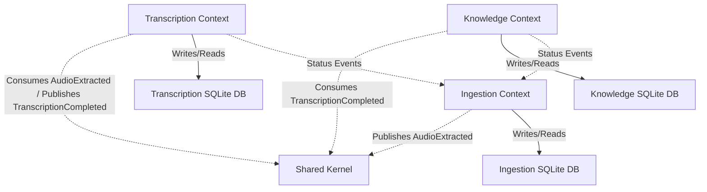

# Context Map — Intelligent Second Brain (ISB)

This map defines the relationships and boundaries between the Bounded Contexts within the ISB Modular Monolith.

## Bounded Contexts

| Bounded Context | Path | Responsibility |
|---|---|---|
| **Ingestion** | [/src/isb/ingestion](file:///mnt/gamer_d/Fausto%20Stangler/Documentos/Python/ISB/src/isb/ingestion) | Handles scraping configuration, media episode metadata fetching, audio extraction (via `yt-dlp`), and tracking of extraction status. |
| **Transcription** | [/src/isb/transcription](file:///mnt/gamer_d/Fausto%20Stangler/Documentos/Python/ISB/src/isb/transcription) | Manages speech-to-text pipeline (via Whisper model inference), text segmentation, and transcription persistence. |
| **Knowledge** | [/src/isb/knowledge](file:///mnt/gamer_d/Fausto%20Stangler/Documentos/Python/ISB/src/isb/knowledge) | Handles compilation of raw transcripts into Obsidian vault notes (Raw layer) and synthesizing cross-referenced wiki articles (Wiki layer) via LLM. |
| **Shared Kernel** | [/src/isb/shared_kernel](file:///mnt/gamer_d/Fausto%20Stangler/Documentos/Python/ISB/src/isb/shared_kernel) | Shared types (`ContentId`, `ProcessingStatus`) and integration events utilized to communicate across context boundaries. |

---

## Context Relationships

### 1. Ingestion ➔ Transcription (Asynchronous Event-Driven)
* **Relationship**: Upstream (Supplier) ➔ Downstream (Customer)
* **Integration**: Ingestion publishes `AudioExtracted` events. Under Option C, these events pass storage/stream references (URLs or location keys) rather than local filesystem paths, separating the extraction output from Whisper processing nodes.

### 2. Transcription ➔ Knowledge (Asynchronous Event-Driven)
* **Relationship**: Upstream (Supplier) ➔ Downstream (Customer)
* **Integration**: Transcription publishes `TranscriptionCompleted` events. Under Option C, the full transcript text and segment lists are passed inline inside the event payload as serialized data, avoiding the need for a shared transcript output file directory.

### 3. Shared Kernel
* **Relationship**: Shared Library
* **Integration**: Both `ContentId` and `ProcessingStatus` are shared binaries. Modifications to these types require synchronization across all contexts.

### 4. Local Context Manifests
* **Relationship**: Context-Isolated State
* **Integration**: Each Bounded Context maintains its own local SQLite database manifest (e.g. `ingestion.db`, `transcription.db`, `knowledge.db`). To keep the master pipeline status updated, Ingestion consumes status-related events published by Transcription and Knowledge, executing updates locally within its own boundaries.

### 5. Context-Encapsulated Event Adapters
* **Relationship**: Architecture Routing
* **Integration**: Event subscriptions are treated as **Incoming Adapters** inside each context's infrastructure layer (e.g. `isb/transcription/infrastructure/event_handlers.py`). The Composition Root (`main.py`) only manages the wiring/registration of these adapters on bootstrap, ensuring that business and translation rules for events remain localized within their respective contexts.

### 6. Independent Retry & Execution Lifecycle
* **Relationship**: Process Autonomy
* **Integration**: Rather than relying on a global pipeline run to trigger retries, each Bounded Context exposes its own independent CLI retry command (e.g., `isb transcribe-failed` or `isb synthesize-failed`). These commands scan their local context databases (`transcription.db`, `knowledge.db`) for `FAILED` tasks and execute recovery operations independently. Successful recoveries publish their completion events, triggering subsequent downstream adapters normally.

### 7. Asynchronous Thread-Pool Event Dispatching
* **Relationship**: Concurrency & Error Isolation
* **Integration**: The shared `EventBus` dispatches events asynchronously by submitting handler executions to a background thread pool (e.g., `ThreadPoolExecutor`). This isolates execution threads, ensuring that any unhandled exception or crash in a downstream subscriber context (like Transcription) does not block or crash the upstream publisher context (like Ingestion).

